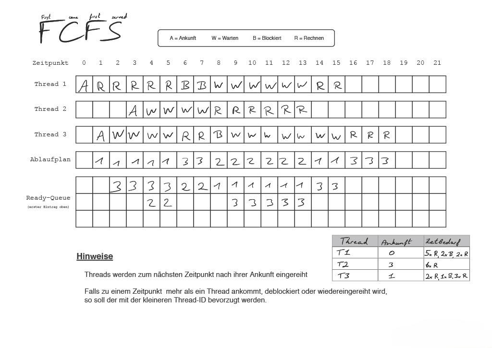
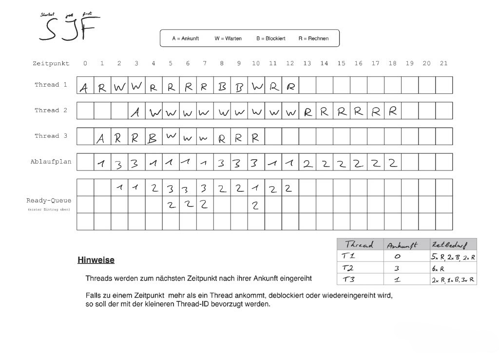
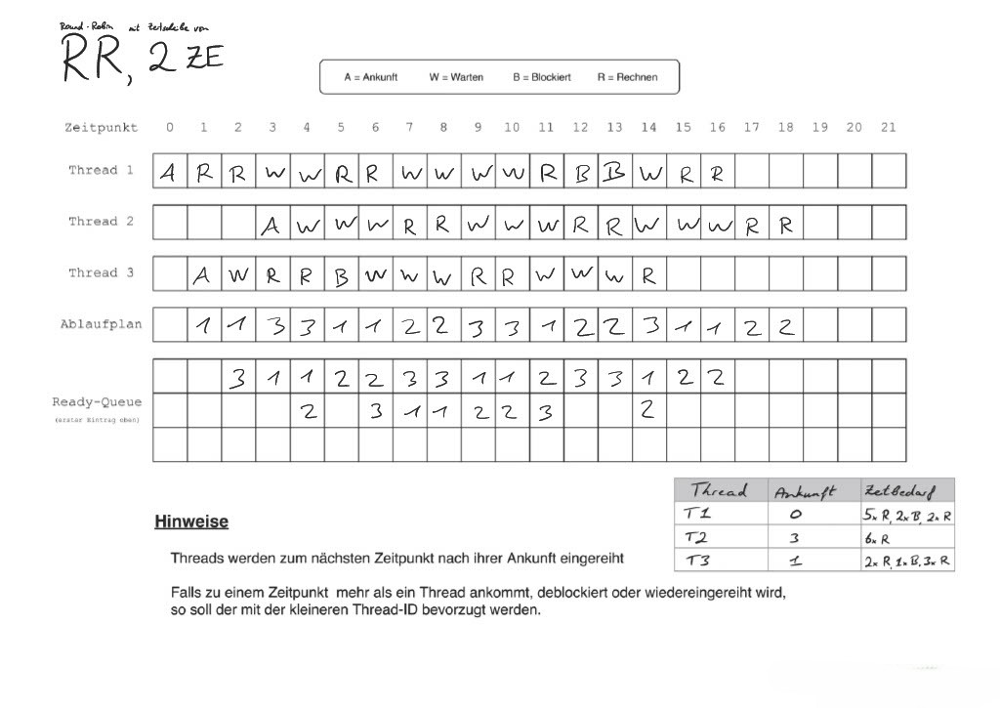

# Aufgabe 6.2: Scheduling

Gegeben sei ein System mit drei Threads T1, T2, T3, deren Ankunftszeit, Bedarf an Rechenzeit und Ein-Ausgabe-Zeit (Blockiert-Zeit) in der folgenden Tabelle angegeben ist.

| Thread | Ankunft | Zeitbedarf |
| --- | --- | --- |
| T1 | 0 | 5 ZE rechnen, 2 ZE blockiert, 2 ZE rechnen |
| T2 | 3 | 6 ZE rechnen |
| T3 | 1 | 2 ZE rechnen, 1 ZE blockiert, 3 ZE rechnen |

Aufgabenteil A

Erstellen Sie die Ablaufpläne nach den Verfahren First-Come-First-Served (FCFS), Shortest-Job-First (SJF) und Zeitscheibenverfahren (Round-Robin, RR) mit einer Zeitscheibe von 2 ZE. Bei FCFS sollen Threads nach dem Blockieren ans Ende der Bereit-Liste angehängt werden. Bei SJF gelte für die Auswahl immer nur der Bedarf an Rechenzeit bis zum nächsten Blockieren. Falls ein Thread bei RR blockiert, kann sogleich der folgende Thread für eine volle Zeitscheibe laufen. Das Umschalten benötige vernachlässigbar wenig Zeit. Verwenden Sie die [Vorgabe für einen Ablaufplan](https://coconucos.cs.hhu.de/lehre/module/bsusp/AblaufplanVorlage.pdf) (Zugansdaten wie bei den Vorlesungsfolien).

> Antwort:
> 
> 
> (1) First-Come-First-Served (FCFS)
> - Threads werden nach Ankunftszeit abgearbeitet
> - Wenn ein Thread blockiert, wird er ans Ende der Warteschlange gesetzt & der nächste ausführbare Thread ausgeführt
> 
> 
> 
> (2) Shortest-Job-First (SJF)
> - Immer der Thread mit dem kürzesten verbleibenden CPU-Bedarf wird ausgeführt
> - Wenn ein Thread blockiert, wird der nächstkürzeste ausgeführt
> 
> 
> 
> (3) Round-Robin (RR, Zeitscheibe 2 ZE)
> - Jeder Thread bekommt maximal 2 ZE Zeit, bevor der nächste in der Warteschlange ausgeführt wird
> - Wenn ein Thread blockiert, wird der nächste ausgeführt
> 
> 
> 

Aufgabenteil B

Berechnen Sie aus den Ergebnissen der vorigen Teilaufgabe jeweils die durchschnittliche Wartezeit auf die CPU.

> (Antwort)
> 
> 
> **Tipp:** Zähle für ein Verfahren die ‘W’s in dem Ablaufdiagramm oder alternativ die Anzahl von Einträgen in der Ready-Queue und teile diese Zahl durch die Anzahl an Threads.
> 
> FCFS:
> 
>  
> 
> $$
> W_D = \frac{21}{3} = 7
> $$
> 
> SJF:
> 
> $$
> W_D = \frac{15}{3} = 7
> $$
> 
> RR: 
> 
> $$
> W_D = \frac{23}{3} \approx 7.66
> $$
